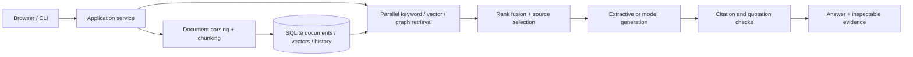

# RAG Assistant · The Reading Room


A local document workbench that answers questions with inspectable sources. Import a document, ask a question, then open every quoted passage behind the answer.

**Version 1.0 is a ground-up implementation**, with a FastAPI application, a responsive browser interface, an installable CLI, and one transactional SQLite index. It replaces the earlier Streamlit/ChromaDB/Neo4j implementation; the old implementation remains in Git history.

## Start in two minutes

Requires Python 3.11 or newer. No API key, model download, Node build, or database server is needed for the default mode.

```bash
python3 -m venv .venv
source .venv/bin/activate
python -m pip install -e '.[dev]'
rag-assistant demo
rag-assistant serve
```

Open **http://127.0.0.1:8000**. Ask: **How does Atlas handle a Redis outage?**
The Atlas example documents are fictional and safe to use in screenshots.

```bash
rag-assistant ingest handbook.pdf notes.md
rag-assistant ask 'What do the documents say about backup retention?'
rag-assistant evaluate
rag-assistant --data-dir /path/to/another-library serve --port 8001
```

The Reading Room uses an editorial layout: a horizontal collection index, spacious reading typography, and source references in the page margin. [Design notes](docs/DESIGN.md) · [Interface gallery](docs/SCREENSHOTS.md).

## What it does

- **Document lifecycle:** PDF, Markdown, TXT, and HTML import; overlapping passages with page/character provenance; content deduplication; atomic replacement by filename; deletion and automatic cache invalidation.
- **Hybrid retrieval:** BM25 keyword ranking, normalized vector similarity, and bounded two-hop traversal through an entity co-occurrence graph. Reciprocal rank fusion combines rankings without confusing ranking scores with relevance. Overlapping passages are deduplicated.
- **Evidence checks:** structured claims reference retrieved source IDs and exact quoted spans. Invalid citations or insufficient textual overlap cause abstention. Every answer retains its evidence, warnings, retrieval method, index revision, and measured timings.
- **A complete workbench:** document filters, retrieval modes, source inspection, graph exploration, saved question history, JSON export, and responsive layouts.
- **Durable state:** SQLite WAL transactions keep document and chunk replacement consistent. A bounded TTL/LRU cache retains full answer evidence and is keyed by index revision and query options.

The offline mode uses **deterministic token-hash vectors and extractive answers**. These vectors are lexical features, not learned semantic embeddings. The graph records co-occurrence, not verified factual or causal relationships. Quote/overlap checks do not prove entailment or factual truth. The displayed relevance is a retrieval signal, not a calibrated probability of correctness.

## Connect a real model

Configuration is read from environment variables. `.env.example` is a reference; the application does not load `.env` automatically.

For a running local Ollama server, set an installed model name:

```bash
export RAG_PROVIDER=ollama
export RAG_MODEL=your-installed-chat-model
export RAG_BASE_URL=http://localhost:11434
rag-assistant serve
```

To use learned embeddings, create a **new index** and import documents again:

```bash
export RAG_DATA_DIR=.rag-semantic
export RAG_EMBEDDING_PROVIDER=ollama
export RAG_EMBEDDING_MODEL=your-installed-embedding-model
export RAG_EMBEDDING_URL=http://localhost:11434
rag-assistant demo
rag-assistant serve
```

OpenAI-compatible services are supported with `RAG_PROVIDER=openai`, `RAG_BASE_URL=https://api.openai.com/v1`, `RAG_MODEL`, and `RAG_API_KEY`. Embeddings have separate `RAG_EMBEDDING_PROVIDER`, `RAG_EMBEDDING_URL`, `RAG_EMBEDDING_MODEL`, and `RAG_EMBEDDING_API_KEY` settings. Remote providers receive the selected text; choose providers appropriate for your documents. JSON-object mode is used for compatibility, followed by local schema validation.

If generation fails, the workbench labels the result as source excerpts. If embeddings fail in hybrid mode, keyword and graph retrieval remain available. Explicit vector mode reports the service failure. Changing embedding identity requires a new data directory so incompatible vectors cannot silently mix.

## Architecture



See [architecture and migration](docs/ARCHITECTURE.md), [validation](docs/VALIDATION.md), and the interactive API reference at `/docs`.

## Develop and deploy

```bash
pytest --cov=rag_assistant --cov-report=term-missing
ruff check .
ruff format --check .
python -m build
docker compose up --build
```

The application is a **single-user local workbench**. It binds to loopback and rejects cross-origin mutations. It has no account system or access control for public hosting; add authentication at a reverse proxy before exposing it. The default index limit is 5,000 chunks, with brute-force vector search intended for personal document collections. Scanned PDFs require OCR before import.

MIT license. Protocol references: [Ollama chat](https://docs.ollama.com/api/chat), [Ollama embeddings](https://docs.ollama.com/api/embed), [OpenAI structured outputs](https://developers.openai.com/api/docs/guides/structured-outputs).
