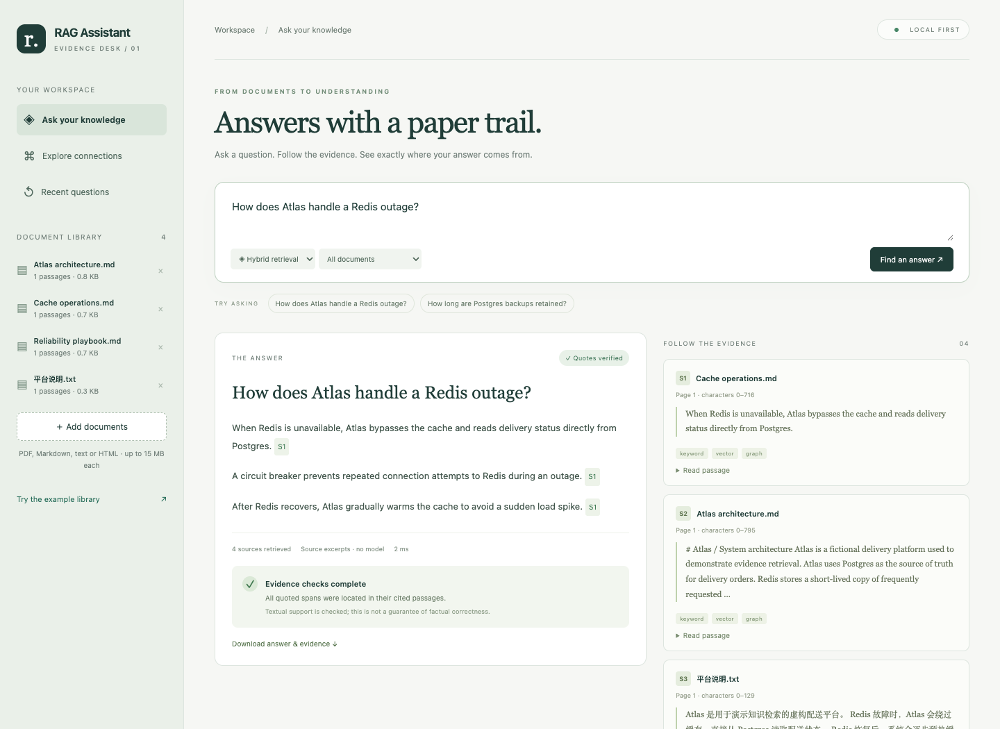
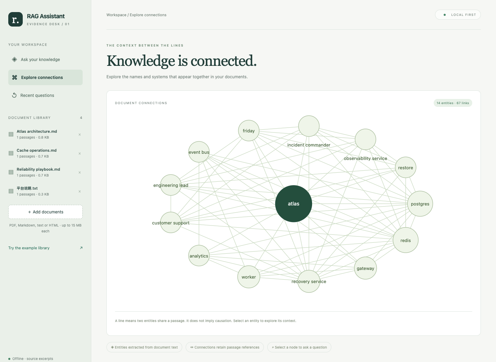
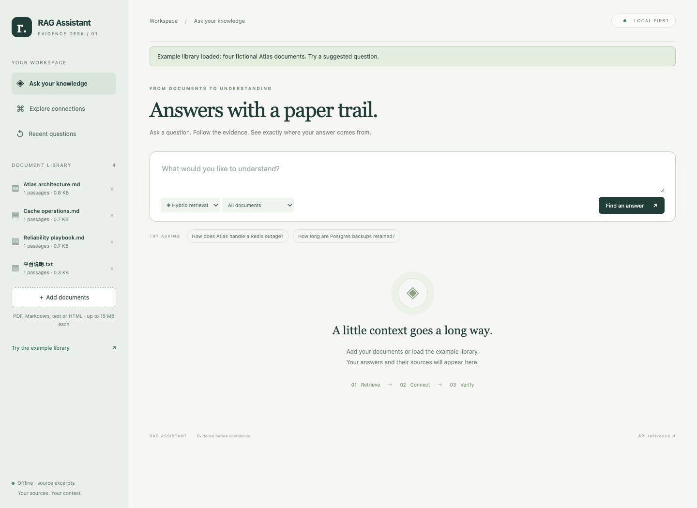
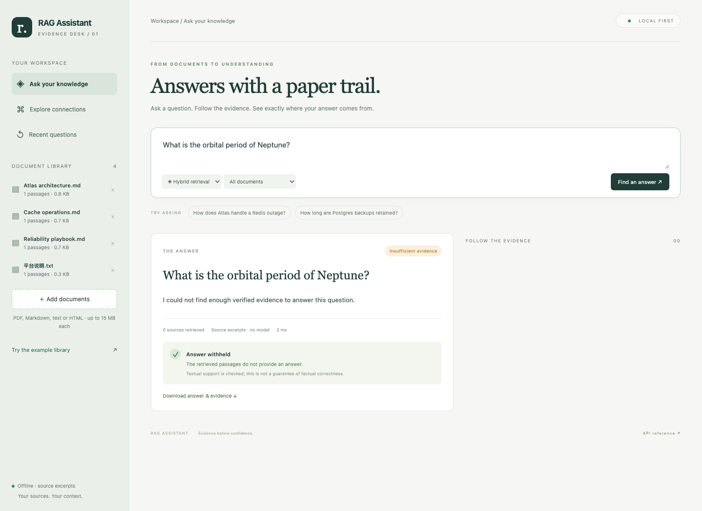
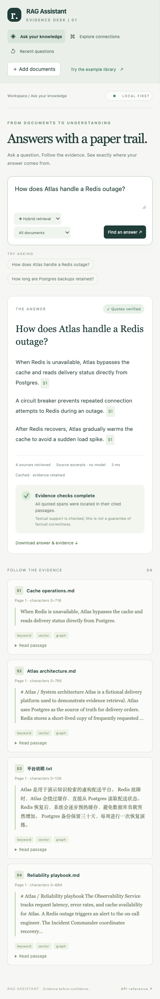

# Screenshots

Captured in Chromium through actual application interactions on 2026-09-08. Desktop viewport: 1440 × 1050. Mobile viewport: 390 × 844. Full-page images retain their natural height.

RAG uses the bundled fictional Atlas corpus in offline extractive mode. MyAgent uses a labelled deterministic model replay with real file operations, pytest execution, and persisted run state. These images do not demonstrate live model performance.

## RAG Assistant — Answers with source citations

Hybrid keyword, vector and graph retrieval with inspectable source excerpts.

## RAG Assistant — Document connections

Explore entity co-occurrence and follow relationships back to document passages.

## RAG Assistant — Document library

Import PDF, Markdown, TXT and HTML files into a persistent local library.

## RAG Assistant — Evidence-aware abstention

The workbench withholds answers when the selected documents do not provide sufficient evidence.

## RAG Assistant — Mobile workspace

The same question-and-source workflow on a narrow screen.
