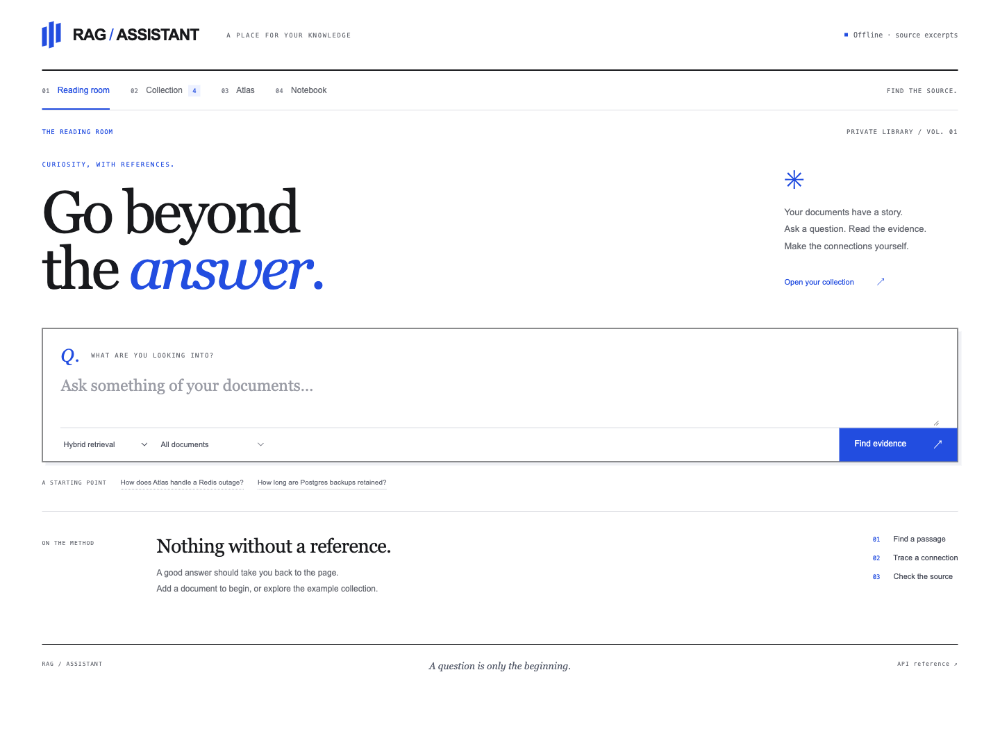
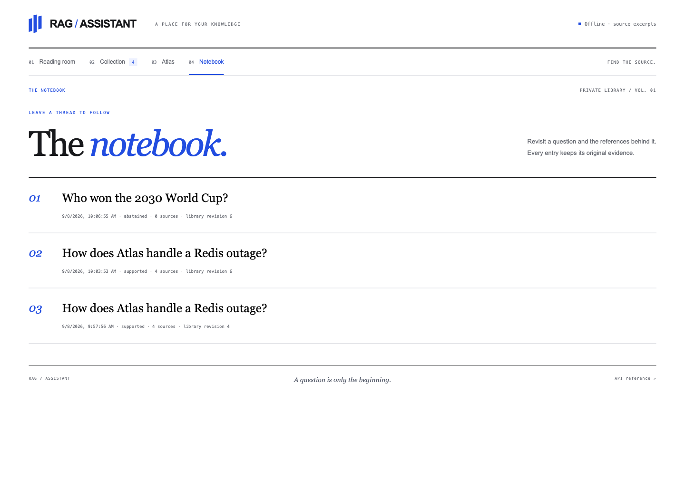

# Interface gallery

Captured in Chromium from the redesigned application on 2026-09-08. See [design notes](DESIGN.md) for layout and interaction decisions. Desktop viewport: 1440 × 1050; mobile viewport: 390 × 844. Original PNG dimensions are listed below.

The RAG screenshots use the fictional Atlas corpus in offline extractive mode.

## RAG Assistant — The Reading Room

An editorial research workspace with a horizontal directory, a focused question composer, and cobalt reference marks.

1440 × 1050 PNG

## RAG Assistant — Read the evidence

An answer presented as a readable article with traceable source passages in the margin.

1425 × 1764 PNG

## RAG Assistant — The collection

A numbered document index with import, removal, and passage metadata.

1425 × 1066 PNG

## RAG Assistant — A connected atlas

Explore entity co-occurrence and select a name to start a source-based question.

1425 × 1190 PNG

## RAG Assistant — Evidence comes first

The answer is withheld when the document collection cannot support it.

1440 × 1050 PNG

## RAG Assistant — The notebook

Return to a saved question with its original references and index revision.

1440 × 1050 PNG

## RAG Assistant — A reading column

A responsive question-and-reference workflow designed for a narrow screen.

375 × 2650 PNG
